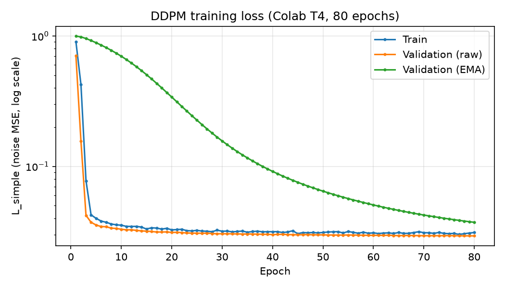
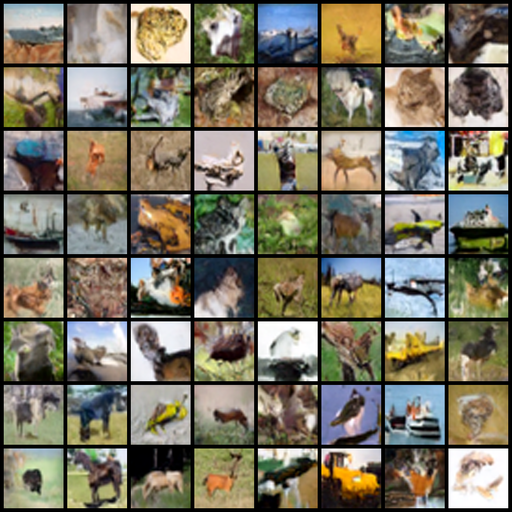
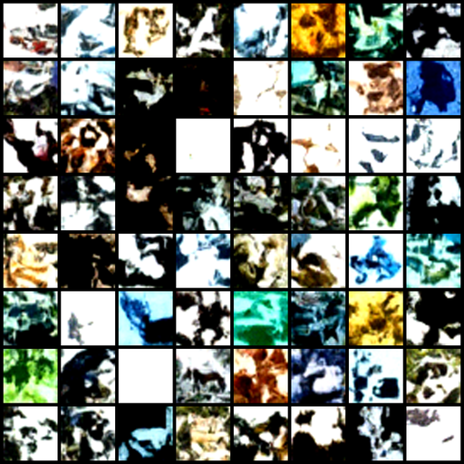
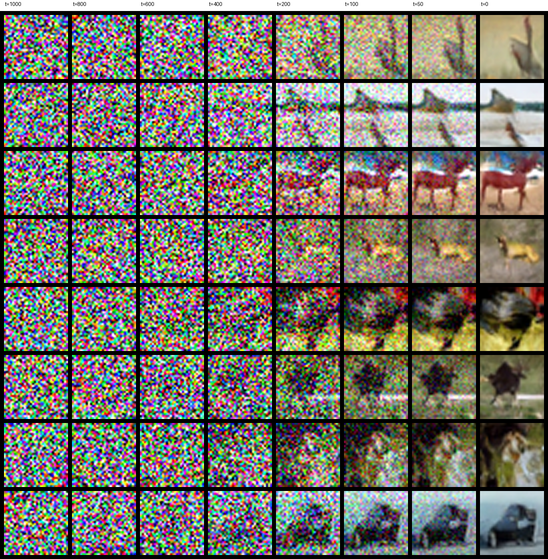
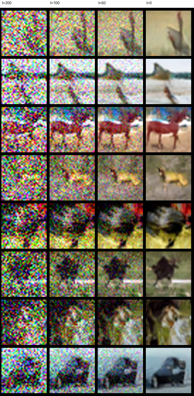
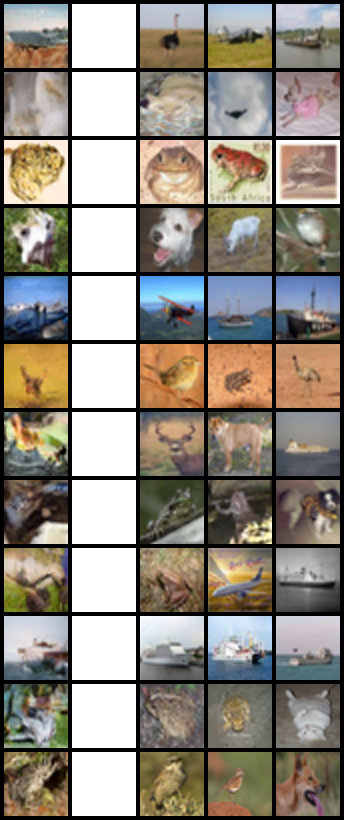

# Technical Report: From-Scratch Denoising Diffusion Probabilistic Model (DDPM) on CIFAR-10

**Assignment**: `GenCV003`, Part 2 (Deliverable a) · **Feature**: `001-create-ddpm` · **Date**: 2026-10-04
**Repository**: `Abd-Elfattah5/Hands-on-DDPM` · **Checkpoint**: release `v0.1.0-ddpm-baseline`
**Sibling reports**: [baseline VAE](https://github.com/Abd-Elfattah5/Hands-on-VAE/blob/main/docs/reports/001-baseline-vae-report.md) · [enhanced VAE + VAE vs. DDPM comparison](https://github.com/Abd-Elfattah5/Hands-on-VAE/blob/main/docs/reports/002-enhanced-vae-report.md#6-vae-vs-ddpm-comparison)

---

## 1. Executive Summary & Objective

This report documents a Denoising Diffusion Probabilistic Model (Ho et al., 2020) implemented from foundational
PyTorch primitives and trained on CIFAR-10. Everything is authored in the repository: noise schedules, forward process,
noise-prediction objective, time-conditioned U-Net and ancestral sampling (Algorithm 2). Pretrained weights are used
only inside the Inception-v3 evaluation metric (Constitution Principle I). The model is evaluated with the **same FID/IS
protocol as the sibling `Hands-on VAE`**, so the two families can be compared directly.

Key outcomes:
- 16.06 M-parameter U-Net trained for **80 epochs (28,080 optimizer steps)** on a Colab T4 in 5.25 h.
- Recognisable, diverse CIFAR-10 samples (horses, deer, birds, cats, ships, cars, trucks) with no memorization in a
  nearest-neighbor check.
- Training loss fell 96.6% (0.906 → 0.031) with no instability; test noise-prediction loss 0.0309.
- **FID 39.69** and **Inception Score 5.18 ± 0.14** under the shared 5,000-sample protocol, against FID 169.02 / 181.00
  and IS 2.11 / 1.68 for the baseline / enhanced VAE.

## 2. Mathematical Formulation

### 2.1 Forward (Diffusion) Process
A fixed Markov chain adds Gaussian noise over $T = 1000$ steps:
$$q(x_t \mid x_{t-1}) = \mathcal{N}\big(\sqrt{1-\beta_t}\,x_{t-1},\ \beta_t I\big),\qquad \beta_t \in [10^{-4},\,0.02]\ \text{(linear)}.$$
With $\alpha_t = 1-\beta_t$ and $\bar\alpha_t = \prod_{s\le t}\alpha_s$, any step is reachable in closed form:
$$x_t = \sqrt{\bar\alpha_t}\,x_0 + \sqrt{1-\bar\alpha_t}\,\epsilon,\qquad \epsilon \sim \mathcal{N}(0, I).$$
At $t = T$, $\bar\alpha_T = 4.04\times10^{-5}$, so $x_T$ is effectively pure noise (verified by `ddpm verify`).

### 2.2 True Reverse Posterior
$$q(x_{t-1}\mid x_t, x_0) = \mathcal{N}\big(\tilde\mu_t,\ \tilde\beta_t I\big),\quad
\tilde\beta_t = \frac{1-\bar\alpha_{t-1}}{1-\bar\alpha_t}\beta_t .$$

### 2.3 Noise-Prediction Parametrization and $L_{\text{simple}}$
The network $\epsilon_\theta(x_t, t)$ predicts the injected noise, giving the reverse mean
$$\mu_\theta(x_t,t) = \frac{1}{\sqrt{\alpha_t}}\Big(x_t - \frac{\beta_t}{\sqrt{1-\bar\alpha_t}}\,\epsilon_\theta(x_t,t)\Big),$$
and is trained with the simplified (re-weighted) variational objective
$$L_{\text{simple}} = \mathbb{E}_{t\sim\mathcal{U}\{1,T\},\,x_0,\,\epsilon}\big\|\epsilon - \epsilon_\theta(x_t, t)\big\|^2 .$$

### 2.4 Ancestral Sampling (Algorithm 2)
Starting from $x_T\sim\mathcal{N}(0,I)$: $x_{t-1} = \mu_\theta(x_t,t) + \sigma_t z$ with $\sigma_t^2=\beta_t$
(`fixed_large`), $z\sim\mathcal{N}(0,I)$ for $t>1$ and $z=0$ at the last step; the output is clamped to $[-1,1]$.

## 3. Architecture & Implementation

**Implementation steps** (each step was gated by unit tests before the next; tasks in `specs/001-create-ddpm/tasks.md`):
1. Config schema, seeding, logging and component registries (as in `Hands-on VAE`).
2. Linear and cosine noise schedules with all derived buffers ($\alpha_t$, $\bar\alpha_t$, posterior terms).
3. Closed-form forward process `q_sample` and the $L_{\text{simple}}$ loss.
4. Time-conditioned U-Net: sinusoidal embedding, residual blocks, attention, skip connections.
5. `ddpm verify` gate: schedule, forward statistics, shapes, gradients, reverse pass, 3 GB memory budget.
6. Trainer: EMA, gradient accumulation, warmup, clipping, checkpoints, resume.
7. Algorithm 2 sampler, sample grids, denoising strips.
8. FID/IS (ported unchanged from the VAE), test loss, class coverage, nearest-neighbor panel.
9. Colab driver notebook, official training run, benchmark, this report.

| Component | Specification | File |
|---|---|---|
| Schedules | `linear` (default), `cosine` (s = 0.008, β ≤ 0.999), float64 precompute | `src/models/schedules.py` |
| Timestep embedding | sinusoidal (64) → Linear(64, 256) → SiLU → Linear(256, 256) | `src/models/embeddings.py` |
| Residual block | GroupNorm(32) → SiLU → Conv3×3 (+ time bias) → GroupNorm → SiLU → Dropout(0.1) → Conv3×3 (zero-init) + skip | `src/models/resnet.py` |
| Attention | 4-head spatial self-attention at 16×16, 8×8 and bottleneck; none at 32×32 (memory). Projections written by hand; the softmax(QKᵀ/√d)V product uses PyTorch's fused `scaled_dot_product_attention` kernel, verified against an explicit implementation in the tests | `src/models/attention.py` |
| U-Net | channels [64, 128, 256], 2 res blocks/level down, 3 up, stride-2 conv down, nearest+conv up, zero-init head; **16,056,451 parameters** | `src/models/unet.py` |
| Diffusion | buffers, `q_sample`, $L_{\text{simple}}$, `p_sample`, batched `sample` with trajectories | `src/models/gaussian_diffusion.py` |
| Training | AdamW 2e-4, 5k-step warmup, clip 1.0, EMA 0.9999, accumulation, NaN/OOM guards, resume | `src/training/` |
| Evaluation | VAE-identical Inception-v3 FID/IS, class coverage, test loss, nearest neighbors | `src/evaluation/` |
| Interface | CLI `ddpm verify / train / evaluate / sample / denoise-strip / benchmark` | `src/cli/main.py` |

Design rationale for every choice is in `ARCHITECTURE_DEEP_DIVE.md`; deviations from the VAE repository are justified in
`docs/adr/0001-deviations-from-hands-on-vae-conventions.md`. 90 unit tests (shapes, schedule and posterior formulas,
gradient flow, Algorithm 2 properties, determinism, EMA, checkpoint/resume, metrics, CLI contract, 3 GB memory budget)
pass before training (Constitution IV).

## 4. Experimental Setup & Training Protocol

| Setting | Value |
|---|---|
| Data | CIFAR-10, [-1, 1], random horizontal flip; 45,000 train / 5,000 val (split identical to the VAE) / 10,000 test |
| Effective batch | 128 (Colab: 128 × 1; local config: 32 × 4 accumulation) |
| Optimizer | AdamW lr 2e-4, weight decay 0, warmup 5,000 steps, gradient clip 1.0 |
| Precision | fp32 |
| Hardware | Tesla T4 (Colab, `notebooks/ddpm_colab_training.ipynb` driving the CLI); evaluation on a Quadro T2000 (4 GB) |
| Epochs | **80 of a planned 100** (time budget), 28,080 optimizer steps, 236 s/epoch, 5.25 h total |
| Seed | 42 for training, splits, sampling and evaluation |

**Weights used for evaluation: raw, not EMA.** With decay 0.9999 the EMA copy still holds $0.9999^{28080}\approx6\%$
of the random initialization after 80 epochs. Its single-step loss is close to the raw model's (test 0.0390 vs 0.0309),
but the error compounds over the 1,000-step reverse chain: **56.9% of EMA sample pixels saturate at ±1** (washed-out
blobs) versus **1.7% for raw weights**. All reported numbers therefore use `--weights raw` (allowed by FR-015;
ADR 0001 D11). EMA would become preferable after roughly 50k+ steps.

## 5. Quantitative Results

### 5.1 Training Trajectory



| Epoch | Train $L_{\text{simple}}$ | Val (raw) | Val (EMA) |
|---|---|---|---|
| 1 | 0.906 | 0.704 | 0.998 |
| 10 | 0.0354 | 0.0329 | 0.6995 |
| 30 | 0.0318 | 0.0304 | 0.1566 |
| 80 | 0.0311 | 0.0293 | 0.0372 |

The raw loss converges within ~15 epochs (typical for ε-prediction: the per-step task is easy), while the EMA curve
lags by design and was still falling at epoch 80.

### 5.2 Benchmark (Shared Protocol: 5,000 generated vs first 5,000 CIFAR-10 test images, IS over 10 splits)

| Metric | DDPM (raw weights, 80 epochs) | Target (spec) | Status |
|---|---|---|---|
| Fréchet Inception Distance ↓ | **39.69** | < 50 (SC-004) | ✓ |
| Inception Score ↑ | **5.18 ± 0.14** | above both VAEs (SC-005) | ✓ |
| Test $L_{\text{simple}}$ (10,000 images) | 0.0309 | — | — |
| Sampling time, 5,000 images (T2000, batch 256) | 2.99 h (2.16 s/image); ≈ 3.0–3.1 h incl. scoring | < 3.5 h (SC-007) | ✓ |
| Parameters | 16,056,451 | — | — |
| Training time | 18,885 s ≈ 5.25 h (Tesla T4) | — | — |

Source: `artifacts/eval/benchmark_metrics.json` (seed 42, torchvision Inception-v3, bilinear resize to 299, IS over
10 splits of 500). With 5,000 samples FID is biased upward relative to 50k-sample literature values, so these numbers
compare to the VAE, not to Ho et al.'s 3.17.

### 5.3 Computational Complexity

| Quantity | DDPM (this work) | VAE baseline / enhanced |
|---|---|---|
| Parameters | 16.06 M | 1.60 M / 2.25 M |
| Network evaluations per generated image | 1,000 | 1 |
| Sampling time (T2000) | 2.16 s/image at batch 256 (2.99 h for the 5,000-image benchmark) | milliseconds |
| Training | 5.25 h (80 epochs, T4); ≈ 6 min/epoch on the T2000 | ~minutes per epoch |
| Peak GPU memory | 1.8-1.9 GB training (32 × 4, T2000); 2.3 GB sampling (batch 256) | 1.84 GB (VAE report) |

Generation cost is the main price of DDPM: three orders of magnitude more network evaluations per image than the VAE.

## 6. Qualitative Analysis

### 6.1 Unconditional Samples (raw weights, seed 42)



**Realism**: global shape and colour are coherent (animal silhouettes on grass, ships on water, vehicles on roads),
far sharper than the VAE's blurred averages; fine texture at 32×32 is still imperfect and some samples are abstract.
**Diversity**: the grid covers most CIFAR-10 object types with varied poses, backgrounds and palettes, with no repeated
samples. **Thematic consistency**: objects sit in plausible contexts (sky/water for ships and planes, grass for horses
and deer), reflecting the dataset's scene statistics.

For comparison, the same seed with the not-yet-converged EMA weights (§4):



### 6.2 The Reverse Process: Structure Emerges Below t ≈ 200

Eight independent reverse chains (rows) captured at $t = 1000, 800, 600, 400, 200, 100, 50, 0$:



Zoom on the last four columns, where the image actually forms:



From $t=1000$ to $\approx 400$ the frames look like noise: the signal coefficient $\sqrt{\bar\alpha_t}$ is 0.0064 at
$t=1000$ and 0.44 at $t=400$, against a noise coefficient $\sqrt{1-\bar\alpha_t}$ of 1.00 and 0.90. **Around $t\approx 200$
($\sqrt{\bar\alpha_t}=0.81$, noise 0.58) coarse layout and colour appear**: a red horse, a car body, a bird against the
sky (signal 0.95 at $t=100$, 0.99 at $t=50$). By $t=100$ and $t=50$ silhouettes are clear and
only high-frequency noise remains, and the last 50 steps refine edges and texture. Diffusion therefore generates
**coarse-to-fine**: most of the semantic decisions happen in the final ~20% of the chain.

### 6.3 Memorization Check (Nearest Neighbors)

Each row: a generated image, a separator, then its 3 nearest CIFAR-10 training images by pixel L2 distance (first 12 of 64 rows):



Across 64 samples the nearest training distance is at least 4.75 (median 9.02, on [0,1] pixels over 3,072 dimensions).
The closest pairs share class, pose and palette (e.g. a chicken-like bird vs. training image #42014) but are different
pictures. **No sample is a copy of a training image** (SC-010).

### 6.4 Distribution Coverage

`ddpm benchmark` records how the 5,000 samples spread over Inception-v3's 1,000 ImageNet classes (CIFAR-10 has no
Inception head, so ImageNet classes act as a fine-grained proxy):

| Measure | Value |
|---|---|
| Distinct top-1 classes | **322** of 1,000 |
| Entropy of the marginal class distribution p(y) | 5.85 nats (uniform over 322 classes would be 5.77; over 1,000, 6.91) |
| Largest single class share | 5.2% (fox squirrel, 259 / 5,000) |

The 20 most frequent predictions map onto CIFAR-10 categories: animal-like classes dominate (fox squirrel,
hartebeest, sorrel horse, spaniels and hounds, patas monkey, black grouse, kit fox, Madagascar cat), reflecting deer,
horse, dog, cat and bird; vehicles appear as moving van, amphibian vehicle and thresher, and ships and planes are
visible in the sample grid. No class exceeds ~5% of samples, so there is **no mode collapse**. Coverage is skewed
toward animals and natural textures, consistent with CIFAR-10 itself (6 of 10 classes are animals) and with
Inception's ImageNet bias. Some predictions (chain saw, milk can) indicate abstract or ambiguous samples, the
low-realism tail also visible in the grid.

## 7. VAE vs. DDPM: Main Difference and Trade-offs

**Main difference.** A VAE compresses an image into a low-dimensional latent $z$ and decodes it in **one step**, trained
with a pixel-space likelihood (ELBO). A DDPM keeps the full image dimension, has **no learned encoder**, and generates by
**iteratively denoising** over 1,000 steps, trained to predict **noise** rather than pixels.

| Aspect | VAE (Hands-on VAE) | DDPM (this work) |
|---|---|---|
| Generation | 1 decoder pass | 1,000 denoiser passes |
| Training target | pixels (L2 → conditional mean) | injected noise ε |
| Typical failure | blur (averaging plausible images) | slow sampling; needs long training for EMA |
| Latent space | compact, interpolable z | none (x_t has image dimension) |
| Training stability | KL/reconstruction balance, posterior collapse risk | plain MSE regression, very stable |
| Sharpness / diversity | low / moderate | high / high |

**Quantitative comparison** (shared protocol). VAE values come from the `Hands-on VAE` benchmark JSONs
(`artifacts/eval/` and `artifacts/eval_enhanced/` there); see the
[baseline VAE report](https://github.com/Abd-Elfattah5/Hands-on-VAE/blob/main/docs/reports/001-baseline-vae-report.md) and
[enhanced VAE report](https://github.com/Abd-Elfattah5/Hands-on-VAE/blob/main/docs/reports/002-enhanced-vae-report.md):

| Model | FID ↓ | IS ↑ | Parameters | Generation cost |
|---|---|---|---|---|
| VAE baseline (d = 32) | 169.02 | 2.11 ± 0.03 | 1.60 M | 1 pass |
| VAE enhanced (d = 128, β-NLL) | 181.00 | 1.68 ± 0.04 | 2.25 M | 1 pass |
| **DDPM (this work)** | **39.69** | **5.18 ± 0.14** | 16.06 M | 1,000 passes |

## 8. Making DDPM Faster: Skipping Timesteps and Cheaper Training

The two most expensive parts of this work were **training** (5.25 h on a T4 for 80 epochs, and still short of EMA
convergence) and **sampling** (1,000 sequential network passes per image, 2.99 h for the 5,000-image benchmark).
Several known techniques, listed in the project's enhancement taxonomy (`architectural_enhancements_taxonomy.html`,
row group 7 "Sampler / Fast Inference"), reduce these costs. None were implemented here because the feature scope
was the baseline Ho et al. model, but they are the natural next step.

### 8.1 Skipping timesteps at sampling time: DDIM (no retraining needed)

DDIM (Song et al., 2021) shows that a network trained with exactly this objective ($L_{\text{simple}}$,
ε-prediction) also defines a **non-Markovian** reverse process that can **jump over timesteps**. Pick a short
increasing subsequence $\tau = (\tau_1 < \dots < \tau_S)$ of $\{1,\dots,T\}$, e.g. every 20th or 50th step, and update

$$\hat x_0 = \frac{x_{\tau_i} - \sqrt{1-\bar\alpha_{\tau_i}}\,\epsilon_\theta(x_{\tau_i},\tau_i)}{\sqrt{\bar\alpha_{\tau_i}}},\qquad
x_{\tau_{i-1}} = \sqrt{\bar\alpha_{\tau_{i-1}}}\,\hat x_0 + \sqrt{1-\bar\alpha_{\tau_{i-1}}-\sigma_{\tau_i}^2}\;\epsilon_\theta(x_{\tau_i},\tau_i) + \sigma_{\tau_i} z .$$

With $\sigma=0$ the process is deterministic (an ODE-like trajectory). Because only the *sampler* changes, the
checkpoint from this report could be reused as is:

| Sampler | Network passes / image | Estimated time / image (T2000, batch 256) | Estimated 5,000-image benchmark |
|---|---|---|---|
| DDPM, Algorithm 2 (this work) | 1,000 | 2.16 s (measured) | 2.99 h (measured) |
| DDIM, S = 100 | 100 | ≈ 0.22 s | ≈ 18 min |
| DDIM, S = 50 | 50 | ≈ 0.11 s | ≈ 9 min |
| DDIM, S = 20 | 20 | ≈ 0.04 s | ≈ 4 min |

The estimates scale the measured per-pass cost linearly. Song et al. report CIFAR-10 FID degrading only modestly
from 1,000 to 50–100 steps, a 10–50× speed-up. Related options: learned interpolated variances (Nichol & Dhariwal,
2021) keep quality with ~50–100 steps; higher-order ODE solvers (DPM-Solver, ~10–20 steps); and progressive
distillation (Salimans & Ho, 2022), which trains a student to halve the step count repeatedly (down to 4–8 steps).

### 8.2 Reducing training time (what would have shortened this run)

DDIM does **not** shorten training: the network still has to learn ε-prediction at all noise levels. Training cost
can be reduced instead by:

- **A shorter EMA horizon.** The raw weights converged in ~15 epochs (§5.1), but EMA 0.9999 needs ~50k+ steps.
  A decay of 0.999, or an EMA warm-up ($\text{decay}_k = \min(0.9999, \tfrac{1+k}{10+k})$), would have made the EMA
  usable within this budget.
- **Mixed precision on a GPU with bf16/fp16 tensor cores** (the T4 has fp16 tensor cores). This was opt-in here
  because fp16 was unstable on the local T2000 (research log).
- **Better noise schedules and loss weighting.** The cosine schedule (implemented, selectable), v-prediction
  (taxonomy row group 3) and importance-sampled timesteps all improve sample quality per training step.
- **Latent diffusion.** Running the diffusion in a compressed latent space (for example the latent of an
  autoencoder like the VAE in the sibling repository) reduces the per-step cost for larger images. For 32×32 CIFAR-10
  the gain is small.

## 9. Limitations

- Trained 80 of 100 planned epochs (28k steps, ~3.5% of Ho et al.'s 800k), so the EMA weights were not usable and FID
  is far from published values.
- FID/IS use 5,000 samples (protocol parity with the VAE); not comparable to 50k-sample literature numbers.
- Sampling cost: ~2 s per image on the local GPU; no accelerated sampler (DDIM, §8) was implemented in this feature.
- Smaller U-Net than Ho et al. (16 M vs 35.7 M parameters) to fit the 4 GB local GPU.

## 10. Conclusion

A DDPM written from first principles, trained for only 28k steps on free hardware, reaches **FID 39.69 and IS 5.18**
under the same protocol on which the VAEs score FID 169-181 and IS 1.7-2.1. That is a 4× lower FID and 2.5× higher IS,
with visibly sharper, more varied samples and no memorization. The improvement comes from the change of objective and
generation procedure, not capacity alone: predicting noise avoids the VAE's pixel-averaging blur, and the iterative
reverse chain builds images coarse-to-fine (§6.2). The costs are equally clear: 10× more parameters, 1,000 network
evaluations per image (≈ 2 s per image on a laptop GPU), and a training budget long enough for EMA weights to converge.
Longer training or a shorter EMA horizon, a larger U-Net, and timestep-skipping samplers such as DDIM (§8,
estimated 10–50× faster generation without retraining) are the natural next steps.

## 11. Reproduction

```bash
gh release download v0.1.0-ddpm-baseline -R Abd-Elfattah5/Hands-on-DDPM -D artifacts/runs/cifar10_baseline
mv artifacts/runs/cifar10_baseline/ddpm_cifar10_baseline_ep080.pt artifacts/runs/cifar10_baseline/best_checkpoint.pt
ddpm benchmark --checkpoint artifacts/runs/cifar10_baseline/best_checkpoint.pt --weights raw --num-samples 5000 --seed 42
ddpm sample --checkpoint artifacts/runs/cifar10_baseline/best_checkpoint.pt --weights raw -n 64 --seed 42 --upscale 4 --nearest --out artifacts/samples/sample_grid_1024.png
ddpm denoise-strip --checkpoint artifacts/runs/cifar10_baseline/best_checkpoint.pt --weights raw --num-images 8 --seed 42
```
